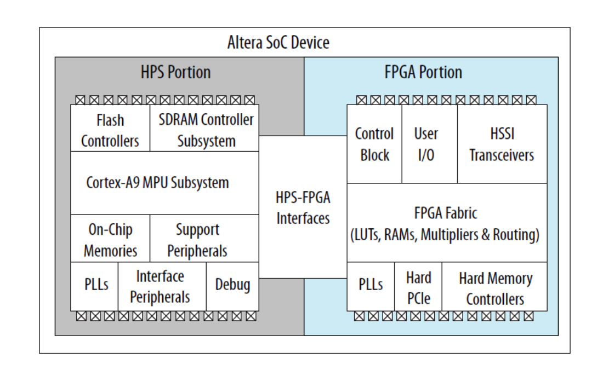
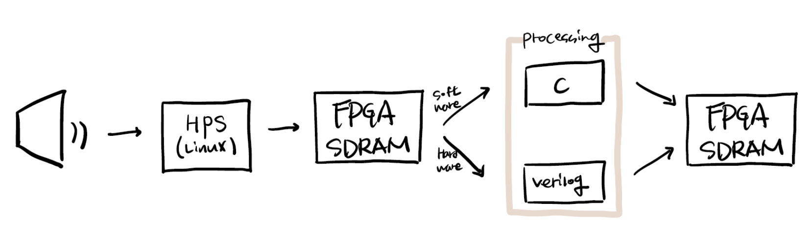
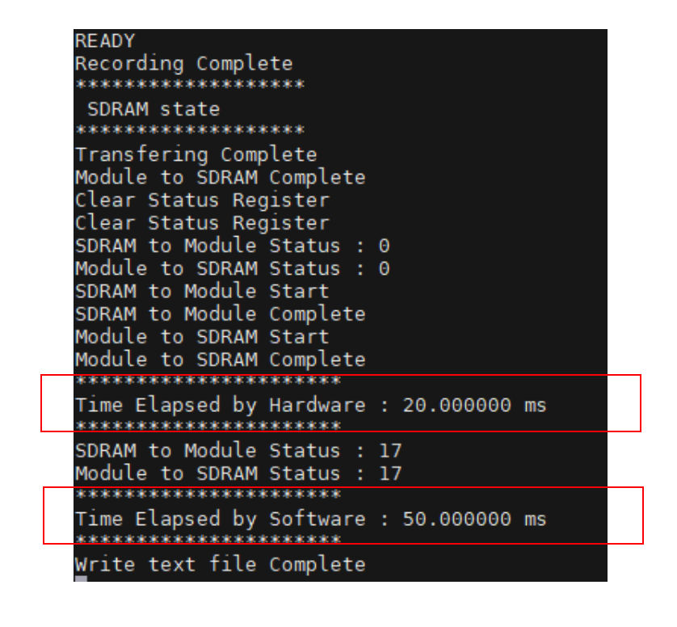

# Comparision of Audio Compression Process Rate between FPGA and HPS
This project compares the speed differences when audio raw datas compressed between FPGAs and HPS.
## Structural features
---

- Cyclone V has two portions which are FPGA Portion and HPS Portion.    
- The two parts made it possible to compare the processing speed.
## Overall Processing
---

- The sound is transmitted through a microphone connected to the FPGA.
- Audio data is processed by the HPS and the FPGA, respectively, through the DMA 
- Compressed audio data is stored again as a SDRAM of the FPGA.
## Result
---

### The Hardware (FPGA) indicates faster processing speed.